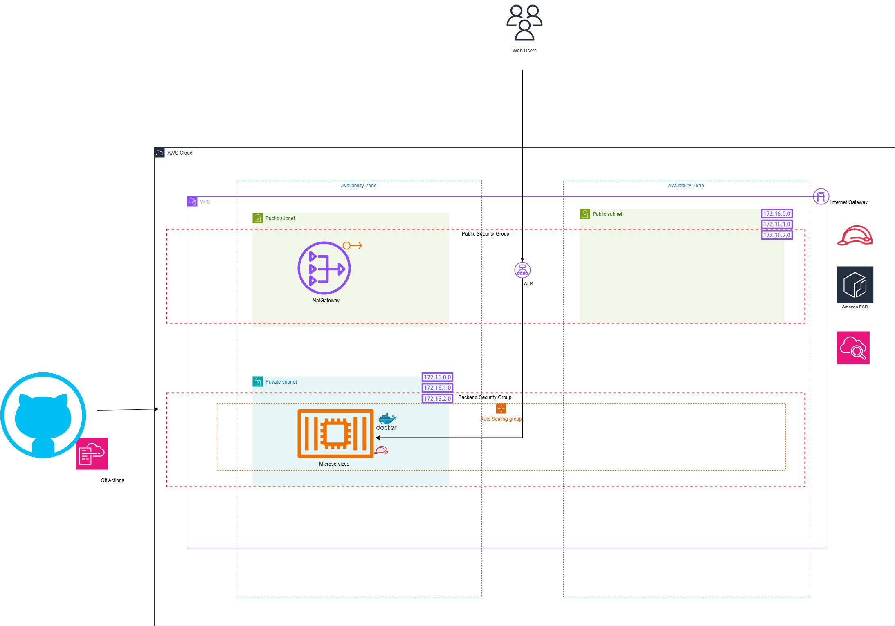

# ECS Deployment - Crispy Doom on AWS

A complete Infrastructure-as-Code (IaC) and CI/CD solution for deploying a containerized Crispy Doom game server with VNC access on AWS using ECS Fargate, ECR, and GitHub Actions.

---

## Table of Contents

- [Architecture Overview](#architecture-overview)
- [Deployment Steps](#deployment-steps)
- [Design Decisions](#design-decisions)
- [Assumptions](#assumptions)
- [Limitations & Future Improvements](#limitations--future-improvements)
- [Project Structure](#project-structure)
- [Prerequisites](#prerequisites)
- [Troubleshooting](#troubleshooting)

---

## Architecture Overview

### High-Level Architecture

The solution follows a modern AWS serverless-on-containers pattern.

> The deployment is CI-driven: GitHub Actions first runs `infra/scripts/cf_deploy.sh` to provision the Terraform backend resources (S3 state bucket, DynamoDB lock table, and secrets bucket) before Terraform initialization. Local bootstrap of these backend resources is not required by the repo design.



### Component Breakdown

#### 1. **Infrastructure Layer (Terraform)**
- **Bootstrap**: CloudFormation script creates S3 backend bucket, DynamoDB lock table, and secrets bucket
- **VPC Module**: Creates the network with 2 public subnets, 1 private subnet, a single NAT Gateway, and routing through that NAT
- **ECR Module**: Provisions Elastic Container Registry for Docker images
- **ECS Module**: Deploys ECS cluster, task definitions, services, and auto-scaling policies
- **Network Security**: Security groups with ingress/egress rules for service isolation

#### 2. **Service Layer (Docker)**
- **Base Image**: `b0nam/debian-novnc:base` (Debian + noVNC + VNC server)
- **Application**: Crispy Doom game server (compiled from source)
- **Exposed Port**: 8080 (noVNC web interface for VNC access)
- **Health Check**: HTTP health check on root path (`/`)

#### 3. **CI/CD Pipeline (GitHub Actions)**
- **Source Control Trigger**: Push/Merge to main branch
- **Build Stage**: Docker image build and ECR push
- **Security Testing**: Checkov static analysis on Terraform code
- **Deploy Stage**: Terraform apply for infrastructure updates
- **Service Update**: Force ECS service to redeploy with latest image

---

## Deployment Steps

### Prerequisites

Before deploying, ensure you have:

1. **AWS Account Setup**
   - AWS Account with appropriate permissions
   - IAM role for GitHub Actions (OIDC-based authentication) / This could be swapped for Access Keys

2. **GitHub Configuration**
   - Repository secrets configured:
     - `ASSUME_ROLE`: ARN of IAM role for GitHub Actions
   - Repository variables configured:
     - `PROJECT_NAME`: `ecs-deployment`
     - `ENVIRONMENT`: `dev` (or your environment)
     - `REGION`: `us-east-1` (or your preferred region)

3. **Tools Required**
   - Docker (for local service testing only)
   - Git
   - AWS CLI (for diagnostics, logs, and workflow support)
   - Terraform only if you want to inspect or extend the infrastructure code locally; the actual deployment is executed in GitHub Actions

### Step 1: Optional Local Docker Test

This repository does not require local Terraform deployment. All remote state and infrastructure provisioning occur in the cloud via GitHub Actions.

Local setup is only useful for building and verifying the service image before committing.

```bash
cd service
docker build -t app-service:latest .
docker run -p 8080:8080 app-service:latest
```

### Step 2: Cloud Deployment via GitHub Actions

The `infra/.github/workflows/terraform_infra.yml` workflow handles the full cloud deployment flow.

The workflow first bootstraps the Terraform backend by running `infra/scripts/cf_deploy.sh`, which creates:
- S3 state bucket: `${ENVIRONMENT}-${PROJECT_NAME}-terraform-state`
- DynamoDB lock table: `${ENVIRONMENT}-${PROJECT_NAME}-terraform-locks`
- Secrets bucket: `${ENVIRONMENT}-${PROJECT_NAME}-secrets-bucket`

After backend bootstrap, the workflow runs `infra/scripts/backend.sh` to initialize Terraform against the cloud backend, then plans and applies the infrastructure remotely.

To deploy, push to `main` or trigger the workflow manually from GitHub.

### Step 3: Verify Deployment

The implementation is cloud-only, but you can verify deployment status through AWS and workflow logs.

```bash
# Check ECS service status
aws ecs describe-services \
  --cluster dev-ecs-deployment-cluster \
  --services dev-ecs-deployment-app-service \
  --region us-east-1

# Check running tasks
aws ecs list-tasks \
  --cluster dev-ecs-deployment-cluster \
  --region us-east-1

# View CloudWatch logs
aws logs tail /dev/ecs-deployment/app-service-logs \
  --follow --region us-east-1
```

### Step 4: Access the Application

```bash
# If ALB is available, access the application via its DNS name:
# http://<alb-dns-name>
# Default VNC password: PASSWORD
```

### Step 5: Automated Deployment via GitHub Actions

Push changes to trigger the remote deployment pipeline:

```bash
git add .
git commit -m "Update infrastructure or service"
git push origin main
```

The CI/CD workflow will:
1. Bootstrap Terraform backend resources via CloudFormation (`cf_deploy.sh`)
2. Initialize Terraform against the remote backend (`backend.sh`)
3. Validate Terraform configuration (`terraform validate`)
4. Plan infrastructure changes (`terraform plan`)
5. Run **Checkov security scanning** on all Terraform code
6. Apply infrastructure changes (`terraform apply` if not a pull request)
7. Build and push the container image to ECR
8. Force ECS service redeployment

---

## Design Decisions

### 1. **ECS Fargate with Spot Instances**

**Decision**: Use Fargate Spot capacity provider instead of traditional EC2 instances.

**Rationale**:
- **Cost Efficiency**: Spot instances offer up to 70% cost savings
- **Operational Simplicity**: No infrastructure management required
- **Scalability**: Auto-scaling handled by AWS (ECS capacity provider)
- **Isolation**: Each task runs in its own isolated environment

**Trade-off**: Spot instances can be interrupted (risk of service disruption). Mitigated by using Fargate Base for critical workloads if needed.

### 2. **Private Application Subnets with NAT Gateway**

**Decision**: Place ECS tasks in private subnets with NAT Gateway for outbound internet access and use an ALB in public subnets for inbound browser traffic.

**Rationale**:
- **Security**: ECS tasks remain in private subnets while public access is fronted by ALB
- **Controlled Access**: Outbound traffic is routed through NAT Gateway
- **Best Practice**: Follows AWS security best practices for containerized workloads
- **Flexibility**: ALB provides a public route without exposing tasks directly

**Trade-off**: Additional NAT Gateway costs (~$32/month). The ALB requires two public subnets for high availability.

### 3. **Terraform Modules for Reusability**

**Decision**: Organize infrastructure into reusable modules (network, ECS, ECR).

**Rationale**:
- **Maintainability**: Separation of concerns makes code easier to understand
- **Reusability**: Modules can be used in multiple projects/environments
- **Testability**: Individual modules can be tested in isolation
- **Scalability**: Easy to add multiple services via `service_config` map

**Structure**:
```
infra/
├── main.tf (module composition)
├── variables.tf (root variables)
├── modules/
│   ├── network/ (VPC, subnets, security groups)
│   ├── backend/ecs/ (ECS cluster, services, auto-scaling)
│   └── backend/ecr/ (Container registries)
```

### 4. **Service Configuration via Variables**

**Decision**: Define service configuration (CPU, memory, ports, auto-scaling) through variables.

**Rationale**:
- **Flexibility**: Easy to add/modify services without code changes
- **Environment Separation**: Different configurations for dev/staging/prod
- **Dynamic**: Uses `for_each` to create resources for each service

**Example**:
```hcl
service_config = {
  app-service = {
    name           = "app-service"
    container_port = 8080
    cpu            = 256
    memory         = 512
    auto_scaling = {
      min_capacity = 1
      max_capacity = 3
    }
  }
}
```

### 5. **Containerized Doom with noVNC**

**Decision**: Use Crispy Doom (port of original Doom) with noVNC for browser-based VNC access.

**Rationale**:
- **Accessibility**: Play classic game directly from browser (no VNC client required)
- **Cloud-Native**: Containerized application suitable for Fargate
- **Lightweight**: Reasonable resource requirements (256 CPU, 512 MB memory)
- **Extensibility**: Base image supports additional packages/modifications

**Design Choices**:
- Base image: `b0nam/debian-novnc:base` (includes VNC + noVNC)
- Game: Crispy Doom (faithful Doom engine port with modern features)
- Port 8080: Standard web traffic port for noVNC interface
- Health check: HTTP health check on root path every 30 seconds

### 6. **GitHub Actions for CI/CD**

**Decision**: Use GitHub Actions workflows for build, test, and deployment.

**Rationale**:
- **Native Integration**: Built into GitHub (no external tool required)
- **OIDC Authentication**: Secure credential management without long-lived secrets
- **Workflow-as-Code**: CI/CD pipeline versioned with code
- **Cost**: Free for public repositories, included with GitHub

**Pipeline Stages**:
1. **Setup**: Determine environment, identify changed files
2. **Build**: Docker image build and ECR push
3. **Deploy**: Terraform apply for infrastructure updates
4. **Verify**: Force ECS service update to deploy latest image

### 7. **CloudWatch Logs for Observability**

**Decision**: Use CloudWatch Logs for centralized container logging.

**Rationale**:
- **Integrated**: Native AWS service (no additional tools)
- **Searchable**: Easy to query logs across all services
- **Retention**: Configurable log retention policies
- **Cost**: Pay only for ingestion and storage

**Configuration**:
```hcl
logConfiguration = {
  logDriver = "awslogs"
  options = {
    awslogs-group         = "/dev/ecs-deployment/app-service-logs"
    awslogs-region        = "us-east-1"
    awslogs-stream-prefix = "dev-ecs-deployment"
  }
}
```

### 8. **Checkov for Infrastructure Security Testing (SAST)**

**Decision**: Use Checkov to scan Terraform code for security misconfigurations and compliance violations before deployment.

**Rationale**:
- **Early Detection**: Catches security issues before they reach AWS
- **Infrastructure as Code Best Practice**: Validates IaC patterns and standards
- **Policy Enforcement**: Checks against CIS benchmarks and AWS security best practices
- **Non-Blocking**: Uses `--soft-fail` to warn without blocking deployment (allows iteration)
- **No Cost**: Open-source tool, no licensing or infrastructure overhead

**Workflow Integration**:
- Runs after `terraform plan` and before `terraform apply` in the CI/CD pipeline
- Scans all Terraform files in the `infra/` directory
- Reports misconfigurations but does not fail the workflow (`--soft-fail` flag)
- Results are visible in GitHub Actions logs for review and remediation

**Checks Performed**:
Checkov validates:
- **Security Groups**: Overly permissive ingress/egress rules (e.g., `0.0.0.0/0`)
- **IAM Policies**: Least privilege violations and wildcard permissions
- **Encryption**: At-rest encryption on S3, DynamoDB, and RDS
- **Logging**: CloudWatch and VPC Flow Logs configuration
- **Tagging**: Resource naming and labeling conventions
- **Network**: Public S3 buckets, exposed databases, unencrypted connections
- **Terraform Best Practices**: Unused variables, missing descriptions, deprecated syntax

**Execution in Workflow**:
```bash
pip3 install checkov --quiet
checkov --directory . --soft-fail
```

The `--soft-fail` flag allows warnings to be displayed without halting the deployment, enabling teams to track and prioritize security improvements incrementally.

### 9. **Remote State Backend**

**Decision**: Store Terraform state in S3 with encryption enabled.

**Rationale**:
- **Durability**: S3 provides 99.999999999% durability
- **Collaboration**: Team members can share state safely
- **Versioning**: Enable S3 versioning to recover from accidental deletions
- **Security**: Encryption at rest and state locking via DynamoDB

---

## Assumptions

### 1. **AWS Account & Permissions**
- AWS account exists with `root` or equivalent permissions
- IAM role for GitHub Actions is pre-created with appropriate permissions
- S3 bucket for Terraform state already exists and is accessible

### 2. **Network Topology**
- VPC CIDR block (10.0.0.0/16) does not conflict with existing VPCs
- Availability zones `us-east-1a` and `us-east-1b` are available in the region
- Security group rules are permissive for lab/dev environment (not production-hardened)

### 3. **Container Image**
- Base Docker image (`b0nam/debian-novnc:base`) is publicly available on Docker Hub
- Crispy Doom source is accessible and builds successfully
- Doom WAD file (shareware version) can be downloaded from Debian repositories

### 4. **Service Requirements**
- Application requires single container instance (desired_count = 1)
- Auto-scaling policies are not aggressive (min=1, max=1)
- Service can tolerate Spot instance interruptions (no SLA requirement)
- Health checks pass within 60 seconds of container startup

### 5. **GitHub Actions**
- `ASSUME_ROLE` secret and `PROJECT_NAME`/`ENVIRONMENT`/`REGION` variables are set
- GitHub Actions has permissions to assume the IAM role
- Repository is publicly accessible for image pulling/pushing

### 6. **Terraform State**
- S3 backend bucket exists with versioning enabled
- DynamoDB table for state locking is configured (optional but recommended)
- Terraform CLI is installed and authenticated

### 7. **DNS & Load Balancing**
- ALB is configured for public traffic across two public subnets
- No custom domain or SSL/TLS certificate is configured yet
- Service is accessed through ALB DNS or direct IP address

### 8. **Development Environment**
- All deployments are to `dev` environment only
- Sensitive data (VNC passwords) are managed outside Terraform
- No production workloads are running in the account

### 9. **Security Scanning (Checkov)**
- Checkov is available in the GitHub Actions environment (installed via pip)
- Security warnings are non-blocking (`--soft-fail` flag allows deployment to proceed)
- Checkov findings are informational and should be reviewed for compliance posture improvement


## Limitations & Future Improvements

### Current Limitations

#### 1. **Limited Load Balancing / Service Discovery**
- **Limitation**: ALB is configured, but custom DNS and HTTPS are not yet implemented
- **Impact**: Public access works, but the service is not fully production-ready for secure ingress
- **Risk**: Browser traffic is still plain HTTP and lacks a friendly domain name
- **Solution**: Add custom domain, SSL/TLS certificate, and DNS routing

#### 2. **Single Task Instance**
- **Limitation**: `desired_count = 1` means only one container running
- **Impact**: No redundancy or fault tolerance
- **Risk**: Service downtime if task fails
- **Solution**: Increase desired_count and implement multi-AZ deployment

#### 3. **No Auto-Scaling**
- **Limitation**: Auto-scaling policies exist but min=max=1 (no actual scaling)
- **Impact**: Cannot handle traffic spikes
- **Risk**: Service degradation under load
- **Solution**: Configure proper auto-scaling thresholds based on metrics

#### 4. **Security Group Overly Permissive**
- **Limitation**: Security group allows broad ingress rules (not production-hardened)
- **Impact**: Potential security exposure in public environments
- **Risk**: Unauthorized access to services
- **Solution**: Implement least-privilege security group rules

#### 5. **VNC Password in Dockerfile**
- **Limitation**: Default VNC password is hardcoded in Dockerfile
- **Impact**: Security weakness (everyone knows the password)
- **Risk**: Unauthorized access to running instances
- **Solution**: Use AWS Secrets Manager for dynamic password injection

#### 6. **No Local Terraform Deployment Path**
- **Limitation**: Infrastructure provisioning is designed to run in the cloud only via GitHub Actions
- **Impact**: There is no supported local deployment workflow for Terraform
- **Risk**: Contributors must use CI/CD for infrastructure changes rather than local execution
- **Solution**: Keep the GitHub Actions pipeline as the canonical deployment mechanism

#### 7. **No Disaster Recovery Plan**
- **Limitation**: No backup/restore procedures documented
- **Impact**: Data loss if S3 state bucket is corrupted
- **Risk**: Infrastructure cannot be recovered
- **Solution**: Implement backup strategy and runbooks

---

### Future Improvements

#### Phase 1: Reliability & Availability
- [ ] Add custom domain and HTTPS to the existing ALB
- [ ] Implement multi-AZ deployment with multiple task instances
- [ ] Configure auto-scaling based on CPU/memory metrics
- [ ] Add health check monitoring and alerting via CloudWatch

#### Phase 2: Security & Compliance
- [ ] Implement VPC Flow Logs for network monitoring
- [ ] Use AWS Secrets Manager for sensitive data (VNC passwords)
- [ ] Add WAF (Web Application Firewall) rules if ALB is added
- [ ] Implement least-privilege IAM policies
- [ ] Enable encryption at rest for ECS task storage

#### Phase 3: Observability & Operations
- [ ] Add X-Ray tracing for service requests
- [ ] Implement custom CloudWatch dashboards
- [ ] Add SNS notifications for service failures
- [ ] Create operations runbooks (troubleshooting guides)
- [ ] Implement centralized log aggregation (e.g., Splunk, ELK)

#### Phase 4: Infrastructure as Code Quality
- [x] Checkov SAST scanning is integrated into the CI/CD pipeline
- [ ] Enhance Checkov with custom rules and stricter policies
- [ ] Add Terratest for integration and acceptance testing
- [ ] Implement tflint for Terraform linting
- [ ] Add pre-commit hooks for local validation before push
- [ ] Implement cost analysis (Infracost integration)
- [ ] Add module versioning and semantic versioning

#### Phase 5: CI/CD Enhancement
- [ ] Add integration tests for Docker image
- [ ] Implement blue-green or canary deployments
- [ ] Add approval gates for production deployments
- [ ] Implement automated rollback on deployment failure
- [ ] Add deployment notifications to Slack/Teams

#### Phase 6: Multi-Environment Support
- [ ] Add staging and production environments
- [ ] Implement environment-specific configurations
- [ ] Add approval workflow for production promotions
- [ ] Implement database migrations (if needed)
- [ ] Add smoke tests for production validation

#### Phase 7: Cost Optimization
- [ ] Analyze Fargate Spot vs. EC2 Spot trade-offs
- [ ] Implement reserved capacity for baseline load
- [ ] Add cost allocation tags for billing
- [ ] Optimize NAT Gateway usage (consider endpoints)
- [ ] Implement Infrastructure Optimization recommendations (AWS Compute Optimizer)

---

## Project Structure

```
ecs-deployment/
├── README.md (this file)
├── ecs-deployment.drawio (Architecture diagram)
├── .github/
│   └── workflows/
│       ├── ci-main.yml (Main CI/CD pipeline)
│       ├── terraform_infra.yml (Terraform deployment)
│       └── service.yml (Docker build and ECS update)
│
├── infra/ (Infrastructure as Code)
│   ├── main.tf (Module composition)
│   ├── variable.tf (Root variables)
│   ├── data.tf (AWS account/region data sources)
│   ├── providers.tf (Terraform provider configuration)
│   ├── backend.tf (S3 remote state backend)
│   ├── dev.auto.tfvars (Development environment variables)
│   ├── README.md (Infrastructure documentation)
│   ├── scripts/
│   │   ├── backend.sh (S3 backend initialization)
│   │   └── cf_deploy.sh (CloudFormation deployment helper)
│   └── modules/
│       ├── network/
│       │   ├── vpc.tf (VPC and main network resources)
│       │   ├── public_subnets.tf (Public subnet configuration)
│       │   ├── app_subnets.tf (Private app subnet configuration)
│       │   ├── internet_gateway.tf (IGW for public subnets)
│       │   ├── nat_gateway.tf (NAT for private outbound)
│       │   ├── route_tables.tf (Routing configuration)
│       │   ├── app_security_group.tf (Security groups for services)
│       │   ├── eip.tf (Elastic IPs for NAT)
│       │   ├── variables.tf (Module variables)
│       │   └── output.tf (Module outputs)
│       ├── backend/ecs/
│       │   ├── main.tf (ECS cluster, task definitions, services)
│       │   ├── variables.tf (Module variables)
│       │   ├── role.tf (IAM roles for task execution)
│       │   ├── logs.tf (CloudWatch log groups)
│       │   ├── auto_scaling.tf (Auto-scaling policies)
│       │   ├── load_balancer.tf (ALB configuration)
│       │   ├── alb_listerners.tf (ALB listener rules)
│       │   ├── eventbridge.tf (EventBridge integration)
│       │   └── data.tf (Data sources)
│       └── backend/ecr/
│           ├── main.tf (ECR repositories)
│           └── variables.tf (Module variables)
│
└── service/ (Application/Service)
    ├── README.md (Service documentation)
    ├── Dockerfile (Docker image definition)
    ├── entrypoint.sh (Container entrypoint script)
    ├── startdoom.sh (Doom game startup script)
    ├── LICENSE (Service license)
    ├── Resources/ (Game resources, documentation)
    │   ├── DOOM-BANNER.png
    │   └── PREVIEW.gif
    └── Docker/ (Docker build scripts)
        └── ... (build utilities)
```

---

## Prerequisites

### AWS Requirements

1. **AWS Account**
   - Active AWS account with billing enabled
   - Sufficient EC2/ECS/ECR quota in us-east-1 region

2. **IAM Setup**
   - Create IAM role for GitHub Actions (OIDC-based)
   - Attach policies:
     - `AmazonECS_FullAccess` (or custom policy)
     - `AmazonEC2ContainerRegistryPowerUser` (ECR access)
     - `AmazonVPCFullAccess` (VPC management)
     - `IAMFullAccess` (for role creation)

3. **S3 Backend**
   ```bash
   aws s3 mb s3://ecs-deployment-tfstate-dev
   aws s3api put-bucket-versioning \
     --bucket ecs-deployment-tfstate-dev \
     --versioning-configuration Status=Enabled
   ```

### GitHub Setup

1. **Repository Secrets**
   ```
   ASSUME_ROLE: arn:aws:iam::<account-id>:role/GitHubActionsRole
   ```

2. **Repository Variables**
   ```
   ENVIRONMENT: dev
   REGION: us-east-1
   PROJECT_NAME: ecs-deployment
   ```

3. **Required Permissions**
   - Read/write access to repository
   - Ability to run workflows

### Local Service Testing (Optional)

Local infrastructure deployment is not part of the standard workflow. All Terraform provisioning, remote state bootstrapping, and state management happen in the cloud via GitHub Actions.

For local Docker service testing only:

```bash
cd service
docker build -t app-service:latest .
docker run -p 8080:8080 app-service:latest
```

If you are contributing to the Terraform code itself, the following tools are useful for code inspection and validation, but they are not required for production deployment:

- Docker
- Git
- AWS CLI
- Terraform (optional)

---

## Troubleshooting

### Common Issues & Solutions

#### 1. **Local Terraform Initialization Fails**

**Error**: `Error: error configuring S3 Backend`

**Note**: This repository is built for cloud deployment through GitHub Actions. The commands below are only relevant if you are running Terraform locally for code inspection or debugging.

**Solution**:
```bash
# 1. Verify S3 bucket exists
aws s3 ls s3://ecs-deployment-tfstate-dev

# 2. Check IAM permissions
aws sts get-caller-identity

# 3. Clear local state
rm -rf .terraform

# 4. Reinitialize with correct backend config
terraform init -backend-config=backend-config.tfbackend
```

#### 2. **ECR Image Push Fails**

**Error**: `denied: User: ... is not authorized to perform: ecr:GetDownloadUrlForLayer`

**Solution**:
```bash
# 1. Verify ECR login
aws ecr get-login-password --region us-east-1 | \
  docker login --username AWS --password-stdin \
  <account-id>.dkr.ecr.us-east-1.amazonaws.com

# 2. Check IAM permissions on user/role
# 3. Verify ECR repository exists
aws ecr describe-repositories --region us-east-1
```

#### 3. **ECS Task Fails to Start**

**Error**: `Task stopped with no running tasks`

**Solution**:
```bash
# 1. Check task logs
aws logs tail /dev/ecs-deployment/app-service-logs --follow

# 2. Verify task definition
aws ecs describe-task-definition \
  --task-definition dev-ecs-deployment-app-service-service

# 3. Check security group rules
aws ec2 describe-security-groups \
  --region us-east-1 --query 'SecurityGroups[?Tags[?Key==`Name`]]'

# 4. Review ECS events
aws ecs describe-services \
  --cluster dev-ecs-deployment-cluster \
  --services dev-ecs-deployment-app-service \
  --region us-east-1 | jq '.services[0].events'
```

#### 4. **Cannot Access Service via Browser**

**Error**: `Connection refused` or `timeout`

**Solution**:
```bash
# 1. Verify service is running
aws ecs describe-services \
  --cluster dev-ecs-deployment-cluster \
  --services dev-ecs-deployment-app-service

# 2. Check security group rules
aws ec2 authorize-security-group-ingress \
  --group-id <sg-id> \
  --protocol tcp \
  --port 8080 \
  --cidr 0.0.0.0/0

# 3. Get public IP of task
aws ecs describe-tasks \
  --cluster dev-ecs-deployment-cluster \
  --tasks <task-arn>

# 4. Test connectivity
curl -v http://<public-ip>:8080
```

#### 5. **GitHub Actions Workflow Fails**

**Error**: `Error: Failed to assume role`

**Solution**:
```bash
# 1. Verify OIDC provider is configured in IAM
# 2. Check ASSUME_ROLE secret is correct ARN
# 3. Verify trust relationship on IAM role:
aws iam get-role --role-name GitHubActionsRole

# 4. Test role assumption locally
aws sts assume-role-with-web-identity \
  --role-arn arn:aws:iam::<account-id>:role/GitHubActionsRole \
  --role-session-name test-session \
  --web-identity-token <github-token>
```

#### 6. **Checkov SAST Scan Warnings**

**Info**: Checkov findings appear in GitHub Actions logs but don't block deployment (`--soft-fail`).

**Understanding the Output**:
- Checkov scans Terraform files for security misconfigurations
- Each finding includes a check ID, description, and severity (PASSED/FAILED)
- Findings are categorized by resource type (e.g., aws_security_group, aws_s3_bucket)
- Uses `--soft-fail` to allow deployment while still reporting issues

**Handling Checkov Findings**:
```bash
# 1. Review findings in GitHub Actions workflow logs
# 2. Check the Checkov documentation for specific check IDs:
#    https://www.checkov.io/

# 3. Common findings and remediation:
#    - CKV_AWS_20: Ensure ALB/NLB use HTTPS/SSL
#    - CKV_AWS_24: Ensure S3 bucket has block public access enabled
#    - CKV_AWS_40: Ensure IAM policies don't allow * as principal
#    - CKV_AWS_3: Ensure CloudTrail log file validation is enabled

# 4. Suppress findings (use with caution):
#    Add skip comment above resource: # checkov:skip=CKV_AWS_<ID>:reason

# 5. Create GitHub issues to track remediation as improvements
```

**To View Checkov Output Locally** (optional):
```bash
# Install Checkov locally
pip install checkov

# Run scan on Terraform code
checkov --directory ./infra --framework terraform

# Generate detailed report
checkov --directory ./infra --framework terraform --output cli
```

### Debug Commands

> These commands are intended for advanced contributors and local inspection only. The standard deployment path is cloud-only via GitHub Actions.

```bash
# View current Terraform state
terraform state list
terraform state show 'module.ecs.aws_ecs_service.private_service["app-service"]'

# Validate Terraform code
terraform validate
terraform fmt -check -recursive

# Plan changes without applying
terraform plan -var-file="dev.auto.tfvars" -out=tfplan.bin
terraform show tfplan.bin

# Destroy resources (use with caution)
terraform destroy -var-file="dev.auto.tfvars"

# View AWS resources created by Terraform
aws ec2 describe-vpcs --region us-east-1 --filters "Name=cidr,Values=10.0.0.0/16"
aws ecs list-clusters --region us-east-1
aws ecr describe-repositories --region us-east-1
```

---

## Additional Resources

- [AWS ECS Documentation](https://docs.aws.amazon.com/ecs/)
- [Terraform AWS Provider](https://registry.terraform.io/providers/hashicorp/aws/latest)
- [Crispy Doom GitHub](https://github.com/fabiangreffrath/crispy-doom)
- [noVNC Documentation](https://novnc.com/)
- [GitHub Actions Documentation](https://docs.github.com/en/actions)
- [AWS IAM OIDC Provider](https://docs.github.com/en/actions/deployment/security-hardening-your-deployments/about-security-hardening-with-openid-connect)

---

## Contact & Support

For questions or issues, please:
1. Check the [Troubleshooting](#troubleshooting) section
2. Review CloudWatch logs via AWS Console
3. Check GitHub Actions workflow logs
4. Create an issue in the GitHub repository

---


**Last Updated**: May 11, 2026  
**Maintained By**: ebhamenteddyjr@gmail.com
